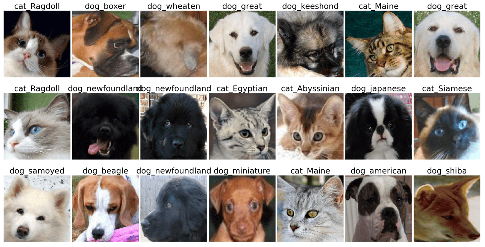

[](https://classroom.github.com/online_ide?assignment_repo_id=7884350&assignment_repo_type=AssignmentRepo)
# Лабораторная работа по курсу "Искусственный интеллект"
# Классификация изображений.

| Студент | Ермакова Анна (вариант 5)|
|------|------|
| Группа  | 301 |
| Оценка 1 (обучение "с нуля") | *X* |
| Оценка 2 (transfer learning) | *X* |
| Проверил | Сошников Д.В. |

> *Комментарии проверяющего*
### Задание

Решить задачу классификации пород кошек и собак на основе датасета [Oxford-IIIT](https://www.robots.ox.ac.uk/~vgg/data/pets/).



#### Задание 1: Классификация Pet Faces

Обучить свёрточную нейронную сеть для классификации пород кошек и собак на основе упрощённого датасета **Pet Faces**. Самостоятельно придумать архитектуру сети, реализовать предобработку входных данных.

Для загрузки датасета используйте следующий код:

```python
!wget https://mslearntensorflowlp.blob.core.windows.net/data/petfaces.tar.gz
!tar xfz petfaces.tar.gz
!rm petfaces.tar.gz
```

В качестве результата необходимо:

* Посчитать точность классификатора на тестовом датасете
* Посчитать точность двоичной классификации "кошки против собак" на текстовом датасете
* Построить confusion matrix
* **[На хорошую и отличную оценку]** Посчитайте top-3 accuracy
* **[На отличную оценку]** Выполнить оптимизацию гиперпараметров: архитектуры сети, learning rate, количества нейронов и размеров фильтров.

Решение оформите в файле [Faces.ipynb](Faces.ipynb).

Использовать нейросетевой фреймворк в соответствии с вариантом задания:
   * Чётные варианты - PyTorch
   * Нечётные варианты - Tensorflow/Keras
#### Задание 2: Классификация полных изображений с помощью transfer learning

Используйте оригинальный датасет **Oxford Pets** и предобученные сети VGG-16/VGG-19 и ResNet для построение классификатора пород. Для загрузки датасета используйте код:

```python
!wget https://mslearntensorflowlp.blob.core.windows.net/data/oxpets_images.tar.gz
!tar xfz oxpets_images.tar.gz
!rm oxpets_images.tar.gz
```

В качестве результата необходимо:

* Посчитать точность классификатора на тестовом датасете отдельно для VGG-16/19 и ResNet, для дальнейших действий выбрать сеть с лучшей точностью
* Посчитать точность двоичной классификации "кошки против собак" на текстовом датасете
* Построить confusion matrix
* **[На отличную оценку]** Посчитайте top-3 и top-5 accuracy

Решение оформите в файле [Pets.ipynb](Pets.ipynb).

Использовать нейросетевой фреймворк, отличный от использованного в предыдущем задании, в соответствии с вариантом задания:
   * Нечётные варианты - PyTorch
   * Чётные варианты - Tensorflow/Keras

## Вывод

В данной лабораторной работе я научилась создавать сверточные сети и использовать уже обученные. Первая сложность с которой я столкнулась , была работа с данными - разделение их на тестовую и тренировочную выборку «вручную», так как скачивание происходило в форме папок с файлами. Во второй лабораторной вычислительной мощности не хватило, поэтому пришлось использовать лишь часть данных. К сожалению обучение моделей проходило примерно по 40 минут, из-за чего после обучения первой среда выполнения прервалась и пришлось заново запускать все ячейки, обучать уже вторую модель и считать cat vs dog и top3 accuracy для второй модели. Но не смотря на это, точность получилась хорошая. В первой работе я снова столкнулась с таким явлением, как переобучение и попыталась исправить это увеличением объема данных с помощью добавления ротации и отражения. В результате проверки модели для разделения теста на кошек и собак в обоих случаях точность оказалась отличной, так же как и в случаи использования top3 accuracy. Confusion matrix для разделения данных на большое количество классов показалась мне не самым хорошим методом визуализации точности предсказания. Таблица получается очень большая. Было интересно получить новые навыки и знания.

## Codespaces

По возможности, используйте GitHub Codespaces для выполнения работы. По результатам, дайте обратную связь:
1. Что понравилось?
1. Что не понравилось?
1. Какие ошибки или существенные затруднения в работе вы встречали? (По возможности, будьте как можно более подробны, указывайте шаги для воспроизведения ошибок)

## Материалы для изучения

* [Deep Learning for Image Classification Workshop](https://github.com/microsoft/workshop-library/blob/main/full/deep-learning-computer-vision/README.md)
* [Convolutional Networks](https://github.com/microsoft/AI-For-Beginners/blob/main/4-ComputerVision/07-ConvNets/README.md)
* [Transfer Learning](https://github.com/microsoft/AI-For-Beginners/blob/main/4-ComputerVision/08-TransferLearning/README.md)
